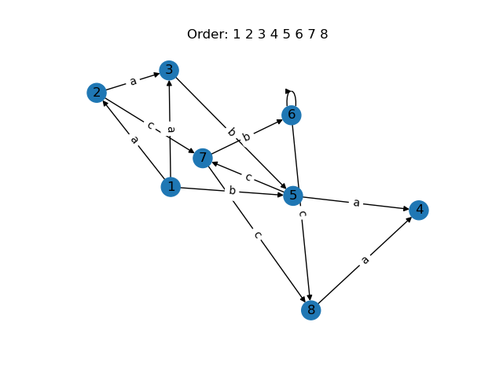

# Wheeler graph visualization
For EN.601.447 Computational Genomics. It has functions for creating graphs, checking whether they satisfy the Wheeler properties, and animating a visualization of the graph. It was written entirely in Python.

This README contains
1. Installation
2. Usage
    * main.py
    * benchmark.py
3. Structure


## Installation
----------------------
Use [Anaconda](https://www.anaconda.com/products/individual) or [Miniconda](https://docs.conda.io/en/latest/miniconda.html) to install all dependencies in an environment. After cloning this repo, creating an environment, and activating the environment, run


```
conda env create --file jhu_comp_gen.yml
```

## Usage
----------------------
There are two important files:
1. [main.py](###main.py)
2. [benchmark.py](###benchmark.py)

### main.py
`main.py` runs a single simulation. It requires a `-p` input file path and `-a` approach type (`naive` or `partition`). The input file must be of our [custom file format](data/README.md). Press `q` to quit the visualization.

```
python main.py -p data/manual/wheeler.txt -a naive
```
The command above should produce this Wheeler graph



If the input file doesn't contain an ordering to verify or the `-no` ignore-ordering flag is used, all possible orderings are checked.
Otherwise, the program verifies the ordering in the input file.

```
python main.py -p data/trie/trie.txt -a partition
```
The command above should produce this animation


Optional parameters include the `-no` ignore-ordering flag, `-nv` no-visualization flag, `-l` numeric log level, and `-s` path to save the visualization to. Any customization of the saved file (e.g. number of frames saved in animation) must be done directly in the [visualize file](visualize.py)

### benchmark.py
`benchmark.py` runs multiple simulations on [data/manual](data/manual) and [data/trie](data/trie). It is used for benchmarking different approaches on different files and creates a dataframe to be saved to a csv file called `bench.csv`

```
python benchmark.py
```
Calling `benchmark.py` with its default parameters overwrites the [csv file](benchmark/bench.csv).
Optional parameters include `-p` output file path name, `-r` number of repetitions, `-m` maximum number of nodes in the manual graphs before skipping the file, `-t` trie files to skip, and `-l` numeric log level

## Structure
----------------------
Folder [benchmark](benchmark) contains benchmark csv files

Folder [data](data) contains all graph input files

* [manual](data/manual) contains hand-annotated graphs with orderings
* [trie](data/trie) contains tries generated with and without orderings
* [trie-input](data/trie-input) contains input files used to generate tries

Folder [images](images) contains all images used for our report.

Files [Trie](Trie.py), [trie-to-graph](trie_to_graph.py), and [generate_dna_input](generate_dna_input.py) are used to create tries

-  `generate_data_input.py` can be run with the following command

  ```python3 generate_data_input a b input.txt``` 

  where `a` is the desired number of lines and `b` is the number of characters per line and input.txt is the name of the input file to be generated.

- `trie_to_graph.py` can be run with the following command

  ```python3 trie_to_graph.py input.txt output.txt ```
 
  which reads the given input file `input.txt`, inserts the lines of the input file into a Trie, and outputs the Trie into the desired graph output file called `output.txt`

File [CreateGraph](CreateGraph.py) reads in a text file and outputs a NetworkX graph representation

File [GraphVerifier](GraphVerifier.py) takes in a NetworkX graph with a given ordering and verifies if it is Wheeler, using either the naive or partition approach.

File [visualize](visualize.py) contains all the drawing-related functions

File [main](main.py) and [benchmark](benchmark.py) house the main driver code and the benchmarking suite.

## Administrative
 -------------------
Contributions.pdf contains a detailed description of who contributed what to this project. 

